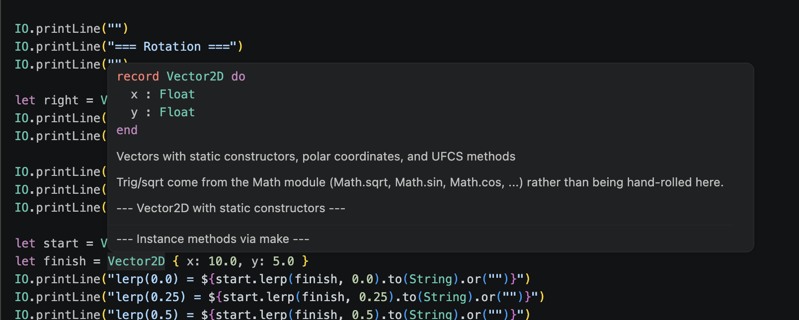

<p align="center">
  
</p>

# Kex Language Support for VS Code

Syntax highlighting, type-aware hover, completion, navigation, and live
compiler diagnostics for [Kex](https://github.com/kexhq/kex) — a functional
language with Ruby-like syntax, immutability by default, UFCS method chains,
and an Elixir-style process model.

The extension is a thin client. Everything it shows comes from the Kex compiler
itself, running as a language server (`kex --lsp`), so hover types and
diagnostics are the compiler's own answers rather than a separate model of the
language that could drift from it.



## Features

- **Type and declaration hover** — the declaration as written, plus any doc
  comments above it.
- **Diagnostics as you type** — syntax, type, and validation errors on the
  unsaved buffer, not just on save.
- **Completion** — members after `.`, and top-level names, with signatures and
  overload counts. See [Known limitations](#known-limitations).
- **Go to definition** and **find references**.
- **Syntax highlighting** for Kex's full grammar.
- **Automatic server restart** when the configured compiler is rebuilt inside
  the workspace.

## Requirements

The extension needs a `kex` executable. Kex ships with **Tey**, its toolchain
manager, and installing Tey installs a working `kex`:

```sh
brew install kexhq/tey/tey
kex --version
```

The `kex` on your PATH is Tey's dispatcher: it runs whichever toolchain Tey has
selected, so there is only ever one compiler command.

```sh
tey kex list [--pre]        # released and installed versions
tey kex install [<version>] # newest stable, or the one you name
tey kex use <version>       # switch what `kex` runs
```

Not on macOS or Linux with Homebrew? Build from source — see the
[repository README](https://github.com/kexhq/kex#readme) — then point
`kex.executablePath` at the binary.

## Installing the extension

It is not on the Marketplace yet. Build a `.vsix` from this directory:

```sh
bun install
bun run package
code --install-extension kex-language-0.1.0.vsix
```

## Settings

| Setting | Default | Description |
| --- | --- | --- |
| `kex.executablePath` | `kex` | Compiler used by the language server. Relative paths resolve from the workspace root, so `build/kex` works when developing Kex itself. |

## Commands

| Command | Description |
| --- | --- |
| **Kex: Restart Language Server** | Restarts the server without reloading the window. |

## Known limitations

Completion resolves the receiver textually, using a heuristic the REPL shares,
so it only understands receivers that are plain identifiers. After a call or
across a line break it returns nothing:

```kex
let box = makeBox(3)
box.g          # completes
makeBox(3).g   # does not
Server.new(8080)
  .g           # does not
```

Hover, diagnostics, definition, and references are unaffected — they use the
compiler's analysis rather than this path.

## Development

1. Build Kex from the repository root: `cmake --build build --target kex`.
2. In this directory, run `bun install` and `bun run compile`.
3. Open this directory in VS Code and press F5 to launch an Extension
   Development Host.
4. Set `kex.executablePath` to `build/kex` when developing Kex itself, or
   install `kex` on `PATH`.

The server can also be driven by any LSP client:

```sh
kex --lsp
```

It communicates over standard input/output using LSP `Content-Length` frames.

When the configured executable is inside the workspace (for example
`build/kex`), rebuilding it automatically restarts the language server. You can
also run **Kex: Restart Language Server** from the command palette.
